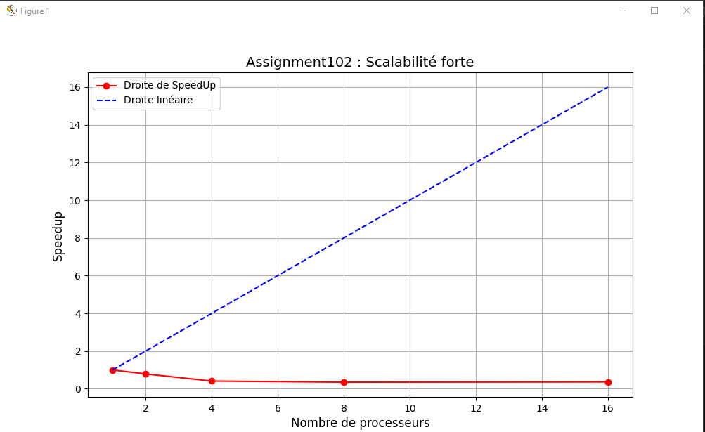

Gouabi Assia <br>
INF3

<div align="center">


# Rapport programmation avancée

<br><br>
Ce document permet de mettre en avant ce qui a été vu lors des séances de TP de programmation avancée en développant les démarches à suivre

</div>

<br><br><br><br><br><br><br>

## Plan
- ### [I - Introduction](#p1)
- ### [II - TP](#p2)
    - ### [Méthode Monte Carlo](#p3)
	- ### [Algorithme et parallélisation](#p3A)
    - ### [Mise en oeuvre sur machine à mémoire partagée (Assignment102.java) ](#p4)
    - ### [Mise en oeuvre sur machine à mémoire partagée (Pi.java) ](#p5)
    - ### [Mise en oeuvre en mémoire distribuée](#p6)
    - ### [Communication avec d'autres machines ](#p7)
	- ### [Qualité et test de performance ](#p8)

<br><br><br>

----------

## <a name="p1"></a> I - Introduction

Dans ce document, nous avons commencé par introduire la méthode de Monte Carlo et nous avons à l'aide de cette méthode réalisée des tests de performance en mémoire partagée et distribuée. 

## <a name="p2"></a> II - TP

## <a name="p3"></a> Méthode Monte Carlo
----------
La méthode Monte Carlo est une technique probabiliste utilisée pour résoudre des problèmes mathématiques complexes en faisant des simulations aléatoires. 
Nous avons vu en détails la méthode Monte Carlo et son fonctionnement pour approximer la valeur de Pi. 

La méthode consiste à tirer un grand nombre de points aléatoires dans une zone donnée et d'analyser la proportion de ces points qui tombent dans la cible. 

Nous allons nous imaginer un carré de côté 1 où l'on insère dedans un quart de cercle de rayon 1. L'aire du carré est 1 tandis que celui du quart de cercle s'exprime sous la forme suivante : 

```
A = A=(πr**2)/4   soit A = π/4
```

Maintenant, nous allons effectuer le tirage de points aléatoires. On a : 

P = (xp, yp)

Chaque coordonnée xp et yp est tirée selon une loi uniforme entre 0 et 1. C'est à dire qu'ils sont égals à 0 ou 1. 

Nous pouvons déterminer la proportion de points présents à l'intérieur de la cible (le quart de cercle) avec la formule suivante : 

Nombre de points dans la cible : ncible
Nombre total de points : ntot

```
ncible/ntot  = π/4
```
Ainsi, pour estimer la valeur de PI on multiplie par 4 : 

```
(4*ncible)/ntot  = π/4
```


## <a name="p3A"></a> Alogorithme et parallélisation

Après avoir décider que nous allons nous appuyer sur un parallélisme de tâche, nous avons décidé de séparer les différentes tâches. 

T0 : Tirer et compter le nombre de total de points
T1 : Calculer Pi

Une fois la séparation des tâches faites, nous les avons décomposé en sous-tâche : 

T0p1 : Tirer xp 
T0p2 : Incrémenter ncible (les points dans la cible)

Une fois les sous-tâches déterminées, nous avons trouver les dépendances suivantes : 
T1 dépend de T0 
T0p2 dépend de T0p1

Nous avons réfléchi et réalisé les pseudo-code suivants : 

* Itération parallèle 

```
initialiser n_cible à 0

pour p allant de 0 à n_tot-1

    xp = valeur alléatoire en 0 et 1
    yp = valeur alléatoire en 0 et 1

    si (xp au carré + yp au carré) inferieur à 1
        ajouter 1 à n_cible
    fin si

fin pour

calculer pi = 4 * n_cible / n_tot
```

* Master/Worker 

```
Worker_MC : parametre(n_tot)
    initialiser n_cible à 0

    pour p allant de 0 à n_tot-1

        xp = valeur alléatoire en 0 et 1
        yp = valeur alléatoire en 0 et 1

        si (xp au carré + yp au carré) inferieur à 1
            ajouter 1 à n_cible
        fin si

    fin pour

revoyer n_cible
```

## <a name="p4"></a> Mise en oeuvre sur machine à mémoire partagée (Assignment102.java)

### Introduction MonteCarlo en mémoire partagée 

Durant cette deuxième séance de TP, nous avons analyser le code d'une des deux classes Java du TP Monte carlo et réaliser le diagrammes UML lui appartenant.
Nous avons commencé par analyser la classe Assignment102.

### Explication : 

Assignment102 utilise des classes de l'API concurrent tels que AtomicInteger, ExecutorService ou Executors. Ces nouveaux éléments ont été recherché dans la documentation Java afin de comprendre leur utilité. 
AtomicInteger permet de manipuler des entiers dans un environnement multithreads. ExecutorService et Executors permettent de gérer l'exécution des tâches.

Dans ce code, on peut distinguer plusieurs classes qui sont liées et interagissent pour estimer la valeur de PI en utilisant la méthode Monte-Carlo. 
On a les classes principales : MonteCarlo, PiMonteCarlo et Assignment102. PiMonteCarlo contient la classe interne MonteCarlo.

### PiMonteCarlo

La classe PiMonteCarlo contient un objet de type AtomicInteger *nAtomSuccess* en attribut. Il correspond dans le cas de la conception établie pour la méthode de Monte Carlo dans la première séance de TP à *nCible*. Le nombre de fois où les points sont dans la cible. 
Nous avons également l'entier *nThrows* qui correspond au nombre d'itérations (nombre de lancers) donc à *nTotal*. Enfin, le troisième attribut de la classe PiMonteCarlo est *value* de type double qui correspond à la valeur estimée de PI.

Dans la méthode getPi(), l'idée principale est de répartir le travail sur plusieurs threads pour accélérer l'exécution. On utilise ainsi le paradigme de l'itération parallèle, qui découpe un problème en sous-problèmes indépendants pouvant être résolus en parallèle. Chaque itération de la boucle dans getPi() est une tâche indépendante, qui génère un point aléatoire et vérifier s'il tombe à l'intérieur de la cible. 

Dans cette méthode, on commence par récupérer le nombre de processeurs disponibles sur la machine pour déterminer le nombre de Thread à utiliser avec Runtime. Runtime qui est l'environnement d'exécution à ne pas confondre avec CPUTime qui est le temps d'exécution. Cette étape est utile puisqu'elle va nous permettre de définir le même nombre de Threads et coeurs. 
Par la suite, on crée un ExecutorService avec en paramètre le nombre de Thread en utilisant Workstealing permettant à d'autres threads de voler des tâches si un thread est inactif. Le vol de tâches est le fait qu'un processeur puisse se rattacher à une autre tâche si elle est bloquée par la section critique.
La classe ExecutorService est gère l'exécution parallèle des tâches. Au lieu de créer un thread pour chaque tâche, Executor permet de découpler les tâches ce qui veut dire qu'on peut avoir un nombre peu important de Threads comparé aux tâches. Jusqu'ici on instancié un nouveau thread on lui passé la Runnable maintenant on utilise Executor et on définit le nombre de threads et tâches.

En clair, dans cette méthode getPI() on estime la valeur de Pi en utilisant la méthode de Monte Carlo, répartie sur plusieurs threads grâce à ExecutorService, 
Le résultat du calcul de PI est déterminé à partir du nombre de points arrivant dans la cible.

### MonteCarlo 

Dans cette classe, qui va être exécutée par chaque Thread, on définit un point de coordonnées x,y et on incrémente le nombre de succès si le point est dans la cible.    

### Assignment102

Elle permet de réaliser l'affichage de données telles que le nombre d'itérations, la valeur de Pi ou le temps d'exécution de la méthode Monte Carlo notamment dans un fichier csv.


*figure 1 : Diagramme de classe des classes Assignment102 et PI*
## <a name="p5"></a> Mise en oeuvre sur machine à mémoire partagée (Pi.java) 

Une fois que nous avons analysé le code Assignment102.java, nous allons procéder à l'analyse de Pi.java. Tout d'abord, en observant l'architecture et la structure du code on s'aperçoit qu'il s'agit d'un paradigme Master/Worker. 


*figure 2 : Illustration du paradigme Master/Worker*

### Pi 

La classe Pi est une classe de test, elle va afficher les résultats de l'exécution 5 fois en ayant spécifier le nombre de workers et le nombre d'itérations que chaque worker devra effectuer. Ici, grâce aux explications sur la méthode Monte Carlo, on affirme que le nombre d'itérations que chaque worker devra effectuer est ntotal et que total est ncible. 

### Master 
 
La classe Master gère la distribution des tâches aux workers et l'agrégation des résultats. 

On commence par mesurer le temps actuel en millisecondes puis on crée une collection, une liste de tâches qui renvoyeront des résultats de type Callable<Long>. Chaque tâche correspond à un worker qui effectue un certain nombre d'itérations dans la simulation de Monte Carlo pour estimer π. Puis, un ExecutorService est crée et qui va être associé aux tâches. Ainsi, il va exécuter toutes les tâches en parallèle via la méthode invokeAll(). 
Une fois que toutes les tâches sont exécutées, les résultats vont apparaitre dans le future et seront récupérés et ajoutés dans total.

Suivant du calcul de Pi, des données telles que la valeur de Pi, le temps d'exécution ou le nombre de processeurs sont affichées dans un fichier csv comme dans la classe Assignment102.

### Callable 

L'interface Callable est similaire à Runnable. Cependant, elle peut retourner un résultat. Elle est utilisée pour des tâches qui peuvent s'exécuter en parallèle et qui ont une valeur de retour (ici <long>).

### Future 

Le but de Future est de fournir un moyen de gérer le résultat d'une tâche qui sera exécutée de manière asynchrone (dans un autre thread). Future permet de vérifier si la tâche est terminée, peut annuler une tâche si nécessaire et récupère le résultat de la tâche une fois terminée. 

### Worker  

La classe Worker peut être exécutée en parallèle dans un autre thread et retourne un résultat de type <Long>. 
La méthode Call() génère aléatoirement des points de coordonnées x et y. Puis elle vérifie si ses points se trouvent dans la cible. Si ils sont présents dedans, on incrémente le compteur circleCount qui représente le nombre de points dans la cible. 


### Pourquoi le paradigme Master/Worker est plus intéressant et performant? 

Il est plus intéressant et plus performant puisqu'on fait le choix de répartir le travail en plusieurs travailleurs et de moins chargé les coeurs. 

## <a name="p6"></a> Mise en oeuvre en mémoire distribuée

### 1. Contextualisation

Pour réaliser la méthode Monte Carlo en mémoire distribuée, nous avons récupéré les classes *MasterSocket.java* et *WorkerSocket*. 
En mémoire distribuée, on travaille par envoie de messages entre un serveur et un client à travers l'intermédiaire de Socket. 
Un Socket est un fichier contenant des informations telles que la source et le contenu de l'envoi ou encore le destinateur avec des flux qui permet l'échange de données entre deux applications. On manipule ses flux en faisant une lecture ou écriture dessus.

### 2. Paradigme Master/Worker

Le paradigme utilisé est Master/Worker. Le Master distribue le calcul entre plusieurs workers, qui calculent chacun une partie du travail. Ces workers envoient leur résultat au Master qui le récupère pour obtenir l'estimation finale de PI.
L'utilisation de ce paradigme et de plusieurs workers permettent d'exécuter des parties du code simultanément, d'améliorer l'efficacité du code et de réduire le temps global d'exécution. 

Dans le contexte de ses classes, la classe WorkerSocket écoute un port spécifique et attend une connexion du Master et la classe MasterSocket se connecte aux workers via leurs ports.

### 3. Explication des classes 

### 3.1 MasterSocket

Cette classe MasterSocket contient 7 champs statiques : le nombre maximum de worker *maxServer*, des ports que les workers utilisent pour communiquer avec le client *tab_port* mais également un tableau contenant les résultats envoyés par chaque worker *tab_total_workers*. 
Nous avons aussi l'adresse IP et des tableaux pour gérer les entrées et sorties et les connexions de socket.

Le programme va demander à l'utilisateur de rentrer le nombre de worker qu'il souhaite utiliser et enregistre la valeur. Par la suite, on effectue une connexion avec chaque worker en utilisant un socket qui se connecte à L'IP du client et le port spécifié parmis la liste *tab_port*. Les messages des worker sont lus avec *reader* et envoyés avec *writer*. 
Dans la boucle while, on répète le calcul de PI autant de fois que l'on veut et on additionne les résultats de chaque worker pour faire une estimation globale de la valeur de PI. 

BufferRead est utilisé pour lire des données, un texte provenant de l'entrée au clavier de l'utilisateur dans le programme. BufferWriter quant à lui est utilisé pour envoyé des données à un worker via un flux de sortie. 

### 3.2 WorkerSocket 

On commence par définir le port sur lequel le serveur va écouté les connexions entrantes. 

Un objet ServeurSocket est crée pour écouter sur le port spécifié. Le serveur attend qu'un client se connecte avec accept(). On peut lire les données envoyées par le client avec BufferedReader et envoyé des réponses avec PrintWriter. 
Enfin, tant que le message reçu n'est pas "END", le serveur effectue le calcul de PI à l'aide de la méthode doRun et envoie le résultat. 

Voici le diagramme de classe associé à ses classes : 


*figure 3 : Diagramme de classe des classes MasterSocket et WorkerSocket*

Nous avons 2 classes principales MasterSocket et WorkerSocket. Les deux dépendent de l'instance de PrintWriter qu'elles créent pour écrire du contenu textuel. De plus, elles dépendent également toutes les deux de BufferedReader pour lire ces contenus textuels. Enfin, MasterSocket dépend de socket qui va permettre de faire la liaison entre Master et Worker pour communiquer. 

### 3.3 Application 

Nous avons commencer par essayer d'exécuter le code WorkerSocket sauf que nous ne pouvions pas passer 2 arguments à la méthode main. Ce qui a été fait est que nous avons editer dans configurations/programs/arguments, nous avons mis le port à 25545 par exemple. 
Puis, on s'aperçoit quand relançant le code on reçoit bien le port indiqué. 

Pour établir, la connexion entre le Master et un Worker, on lance la classe MasterSocket en précisant 1 pour le nombre de worker suivi du port 25545 qui a été ouvert précédemment. 

Pour lancer plusieurs workers, dans la configuration, nous allons ajouter une nouvelle application et définir un nouveau port en plus de celui précédent. En exécutant MasterSocket, au lieu de préciser 1 seul worker dans la console, on en met 2. Enfin, on entre les deux ports l'un à la suite de l'autre. 


Remarque : On modifie la conception du code

Ce qu'il faut faire il faut que le masterSocket écrive dans un fichier les résultats que leur envoie chaque worker concernant le calcul de Pi avec un seul Thread par worker 
Reprendre les tableaux que nous avions fait en qualité dev et faire les tests 
mais cette fois-ci c'est en mémoire distribuée avec Socket et par envoie de message 


## <a name="p7"></a> Communication avec d'autres machines 

Durant une des séances de TP, nous avons fait en sorte d'établir une communication entre différentes machines de la salle à l'aide de leur adresse IP. 

Nous avons basculé sur CentOs et tenter d'installer Java sur celui-ci avec la commande suivante :

```
yum install java-devel
```
Une fois Java installé, nous avons récupérer le dossier *distributedMC_step1_javaSocket* fourni par notre professeur pour récupérer le MakeFile

Par la suite, nous avons effectuer des tests du code Java des deux classes avec : 

```
 java WorkerSocket.java 25545
```

et : 

```
 java MasterSocket.java 
```
Suivi du nombre de worker et l'adresse Ip de la machien ayant lancé le port 25545

Nous avons rencontrer quelques problèmes à exécuter ses codes car il fallait désactiver le parfeu sur les machines : 

```
firewall-cmd --zone=public --add-port=25545/tcp
```

Nous avons pu réalisé des expériences avec mes collègues qui seront présents dans la section ci-dessous "Qualité et test de performance".

## <a name="p8"></a> Qualité et test de performance 

Dans cette partie, nous allons nous appuyer sur la norme ISO 25010 qui définit un modèle de qualité pour les logiciels. Nous allons nous attarder plus précisément sur la sous-caractéristique "Efficiency" de la section "Quality in use". Efficiency mesure la performance du logiciel lorsqu'il est utilisé par plusieurs utilisateurs en prenant en compte le facteurs temps. 

Le temps se calcule de la manière suivante : 
```
Temps (speed up)  = Tt / Ta

on a : 
- Tt : Target Time 
- Ta : Actual Time

```
A partir de ça, on peut déterminer l'erreur relative "Task Time"

```
(Tt-Ta)/Tt
```
Pour commencer, nous allons effectuer des tests de performance afin de tester la capacité de notre système à fonctionner efficacement sous différentes conditions des classes énumérées précédemment : Assignment102.java, Pi.java, MasterSocket.java et WorkerSocket.java 

Les tests ci-dessous et les graphiques ont été réalisé sur mon architecture personnelle, il est important de spécifier les caractéristiques ci-dessous puisque d'une machine à une autre tout peu changer

Les caractéristiques : 

|Elements| Architecture | 
|--------|-----|
| Processeur   | Intel(R) Core(TM) i5-8265U CPU @ 1.60GHz   1.80 GHz  | 
| Mémoire RAM  | 8,00 Go  | 
| Nombre de coeurs | 4  | 
| Nombre de Threads | 8  | 

Le but était de réaliser des tests de performance en illustrant la scalabilité forte et faible à travers des graphiques pour les classes évoquées précédemment. 

- Scalabilité forte : Vise à réduire le temps d'exécution d'une charge de travail donnée en augmentant les ressources.

- Scalabilité faible : Vise à maintenir les performances constantes malgré une augmentation de la charge de travail, en ajoutant des ressources.
 
 Pour cela, il fallait déterminer certains facteurs notamment le speedup. 

Le speedup est utilisé pour évaluer l'efficacité du parallélisme dans les calculs. Il mesure le gain de performance obtenu en augmentant le nombre de cœurs utilisés.
Il se calcule par la formule suivante : 

```
speedUp = Temps 1coeurs / Temps nCoeurs
```

### Assignment102 

* Scalabilité forte 

Tests effectués : 

| **numIterations** | **nbProcessor**                                | **Time Duration** |
|-------------------|------------------------------------------------|-------------------|
| 1 000 000         | 1 | 195.8 ms             |
| 1 000 000           | 2  | 247,4 ms             |
| 1 000 000        | 4      | 476,2 ms             |
| 1 000 000         | 8      | 553,2 ms             |
| 1 000 000         | 16    | 533,8 ms            |


<br>
On observe que notre droite speed up ne suit pas la droite idéale (en bleue) ce qui signifie une performance mauvaise lorsque l'on augmente le nombre de processeurs (on le double). En effet, on voit une staturation car au fur et à mesure qu'on double le nombre de processeurs le speed up stagne autour de 1 et n'évolue pas. 
<br><br>

* Scalabilité faible 

| **numIterations** | **nbProcessor**                                | **Time Duration** |
|-------------------|------------------------------------------------|-------------------|
| 1 000 000         | 1 | 177.8 ms             |
| 2 000 000           | 2  | 535.2 ms             |
| 4 000 000        | 4      | 1923 ms             |
| 8 000 000         | 8      | 4835.2 ms             |
| 16 000 000         | 16    | 9770.4 ms            |


<br>
On observe une chute du Speed up lorsque le nombre de processeurs augmente puis à partir de 8 processeurs il se stabilise mais reste mauvais. La courbe montre que le programme ne parvient pas à maintenir ses performances lorsqu'on augmente la taille du problème en même temps que le nombre de processeurs. 

### PI

* Scalabilité forte  

| **numIterations** | **nbProcessor**                                | **Time Duration** |
|-------------------|------------------------------------------------|-------------------|
| 1 000 000         | 1 | 516.4 ms             |
| 1 000 000           | 2  | 231.2 ms             |
| 1 000 000        | 4      | 200 ms             |
| 1 000 000         | 8      | 103.6 ms             |
| 1 000 000         | 16    | 131 ms            |


<br>
Nous observons que jusqu'à 2 processeurs la courbe du speed up égale celle idéale. Cependant, elle finit par subir des variations par la suite. 
<br><br>

* Scalabilité faible  

| **numIterations** | **nbProcessor**                                | **Time Duration** |
|-------------------|------------------------------------------------|-------------------|
| 1 000 000         | 1 | 63.8 ms             |
| 1 000 000           | 2  | 72.6 ms             |
| 1 000 000        | 4      | 71 ms             |
| 1 000 000         | 8      | 103.2 ms             |
| 1 000 000         | 16    | 196.6 ms            |


<br>
Nous observons une chute progressive de la courbe de speed up qui présente des résultats mauvais par rapport à celle idéale. 
<br><br>

J'ai par la suite réalisé ses expériences sur les machines en salles TP de la salle G24 pour pouvoir comparer les deux expériences.

Les caractéristiques : 

|Elements| Architecture | 
|--------|-----|
| Processeur   | Intel® Core™ i7-9700 CPU @ 3.00GHz × 8   | 
| Capacité du disque  | 512 Go  | 
| Nombre de coeurs | 8 | 
| Nombre de Threads | 8  | 

### Assignment102 

* Scalabilité forte 

Tests effectués : 

| **numIterations** | **nbProcessor**                                | **Time Duration** |
|-------------------|------------------------------------------------|-------------------|
| 1 000 000         | 1 |   104.8           |
| 1 000 000           | 2  |  132.8          |
| 1 000 000        | 4      |  146.8            |
| 1 000 000         | 8      | 397.4           |
| 1 000 000         | 16    |  417.6          |


<br>
On observe que notre droite speed up ne suit pas la droite idéale (en bleue) ce qui signifie une performance mauvaise lorsque l'on augmente le nombre de processeurs. La seule différence entre la courbe observée pour l'expérience avec mon ordinateur personnel est que de 2 à 4 la courbe est plus constante. 

<br>

* Scalabilité faible 

| **numIterations** | **nbProcessor**                                | **Time Duration** |
|-------------------|------------------------------------------------|-------------------|
| 1 000 000         | 1 |     90.6        |
| 2 000 000           | 2  |   233.2          |
| 4 000 000        | 4      |  433.8         |
| 8 000 000         | 8      |  1391.6         |
| 16 000 000         | 16    |  2624.4          |


<br>
Nous observons la même courbe que l'exemple précédent avec mon ordinateur personnel. 
<br>

### PI

* Scalabilité forte  

| **numIterations** | **nbProcessor**                                | **Time Duration** |
|-------------------|------------------------------------------------|-------------------|
| 1 000 000         | 1 |  346.4           |
| 1 000 000           | 2  |  195.4         |
| 1 000 000        | 4      |  110           |
| 1 000 000         | 8      |  131.4         |
| 1 000 000         | 16    |  133.8       |


<br>
Nous observons par rapport à la première courbe qu'elle se rapproche plus longtemps de la courbe idéale. 
<br><br>

* Scalabilité faible  

| **numIterations** | **nbProcessor**                                | **Time Duration** |
|-------------------|------------------------------------------------|-------------------|
| 1 000 000         | 1 |   348.6         |
| 1 000 000           | 2  |  356.6            |
| 1 000 000        | 4      |   360          |
| 1 000 000         | 8      |  459.4          |
| 1 000 000         | 16    |  840.4          |


<br>
Enfin, contrairement à la courbe faite à partir des données de mon ordinateur personnel, on observe une chute directe. 
<br><br>

Conclusion : 

Nous pouvons en conclure que sur cette expérience, pour les deux architectures, les résultats des courbes de speed up sont loins de l'idéal voulu. De plus, nous observons qu'il n'y a pas réellement de grosse différence de performance entre l'ordinateur de 4 coeurs et celui de 8. 


Après avoir étudier les codes en mémoire partagée et réaliser des tests de performances, nous avons tous réalisé l'expérience en mémoire distribuée. Il s'agissait avec un Master et plusieurs workers de faire fonctionner la méthode de Monte Carlo, établir la scalabilité forte, faible et tracer la courbe de speed up. 
De nombreux tests ont été effectué à partir d'1 à 12 machines au maximum pour obtenir les temps d'exécution. 

* Scalabilité forte  

| **Machines** | **Points totaux** | **Points / Worker** | **Nb Processeurs** | **Temps (ms)** |
|--------------|-------------------|---------------------|--------------------|----------------|
| 1            | 192000000         | 192000000           | 1                  | 5873           |
| 1            | 192000000         | 48000000            | 4                  | 1506           |
| 2            | 192000000         | 24000000            | 8                  | 756            |
| 3            | 192000000         | 16000000            | 12                 | 508            |
| 4            | 192000000         | 12000000            | 16                 | 385            |
| 6            | 192000000         | 8000000             | 24                 | 267            |
| 8            | 192000000         | 6000000             | 32                 | 206            |
| 12           | 192000000         | 4000000             | 48                 | 133            |

Avec ses données récupérées lors de l'expérience, on obtient la courbe de speed up suivante : 


<br><br>

* Scalabilité faible  

| **Machines** | **Points totaux** | **Points / Worker** | **Nb Processeurs** | **Temps (ms)** |
|--------------|-------------------|---------------------|--------------------|----------------|
| 1            | 4000000           | 4000000             | 1                  | 129            |
| 1            | 16000000          | 4000000             | 4                  | 140            |
| 2            | 32000000          | 4000000             | 8                  | 143            |
| 3            | 48000000          | 4000000             | 12                 | 136            |
| 4            | 64000000          | 4000000             | 16                 | 134            |
| 6            | 96000000          | 4000000             | 24                 | 139            |
| 8            | 128000000         | 4000000             | 32                 | 140            |
| 12           | 192000000         | 4000000             | 48                 | 141            |

Avec ses données récupérées lors de l'expérience, on obtient la courbe de speed up suivante : 


### Evaluation numérique (Erreur)

L'erreur est la différence qui sépare la courbe speed up qu'on obtient et la courbe idéale. Plus l'erreur est proche de 0 plus c'est bon signe. 

Pour réaliser les nuages de points d'erreur en fonction du nombre d'itérations, j'ai utilisé les données des fichiers csv exécutés sur ma machine personnelle. 

### PI

* Scalabilité forte  

| Nombre d'itérations | Error      |
|----------------------|-----------|
| 10000000            | -0,000046  |
| 10000000            | -0,000047  |
| 10000000            | -0,000013  |
| 10000000            | 0,000036   |
| 10000000            | -0,000003  |
| 10000000            | -0,000232  |
| 10000000            | 0,000047   |
| 10000000            | -0,000128  |
| 10000000            | 0,000065   |
| 10000000            | -0,000003  |
| 10000000            | -0,000094  |
| 10000000            | -0,000018  |
| 10000000            | -0,000026  |
| 10000000            | -0,000137  |
| 10000000            | 0,000164   |
| 10000000            | -0,000120  |

J'ai fais de même pour 20000000, 40000000, 80000000 et 160000000

Nous obtenons ainsi le nuage de point suivant avec les données ci-dessus : 


